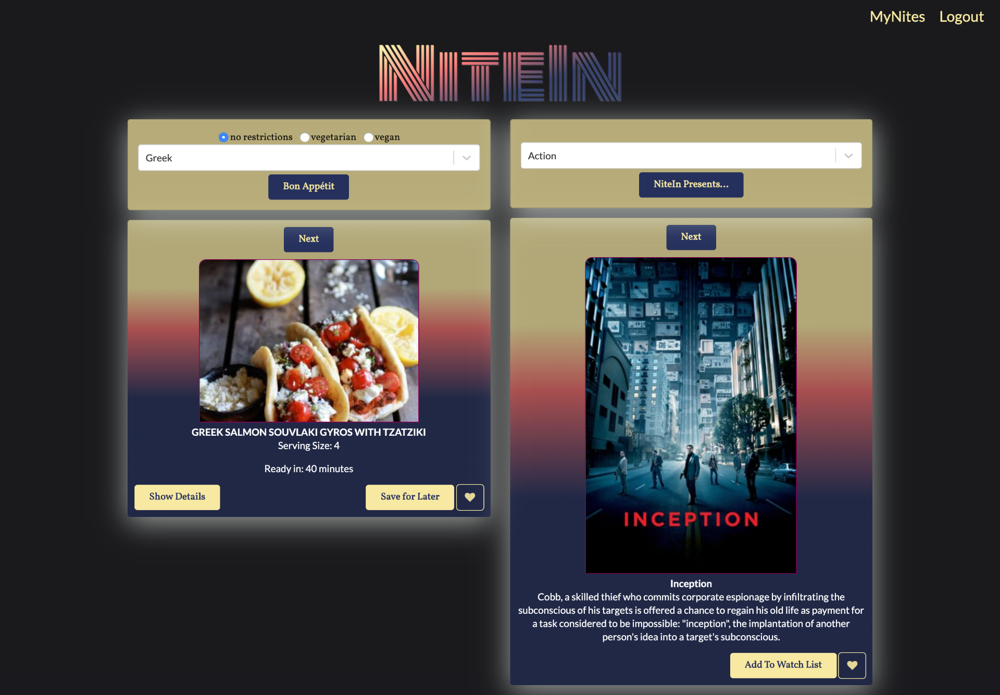
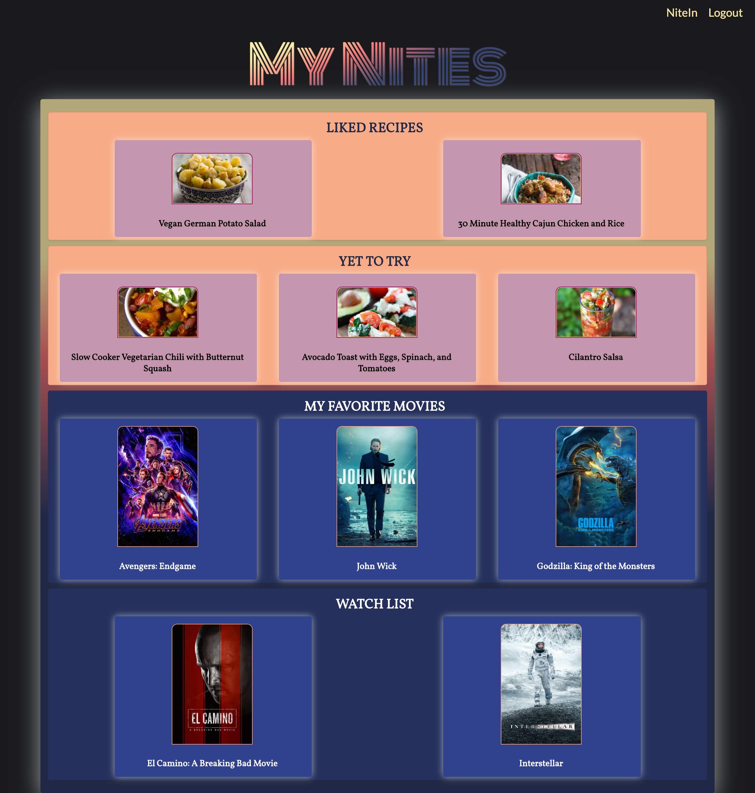

# NiteIn
Are you the type of person to go out every night? Chances are you're not. Everyone loves having a night in to themselves, and this app was designed to plan those nights in with

# Motivation
My wife and I are what I consider regular homebodies. We enjoy our time together and love hanging out at home in the evenings. Like most people we get too caught up browsing through movies on Netflix, HBO, Disney+, and all of the other streaming services out there. Along with that, we spend way too long searching through the endless recipes on Pinterest trying to find something to make. This app has solved that problem and has saved us quality time during our nights in together.

# Screenshot #1

# Screenshot #2

# Tech/Frameworks Used
### Front-End:
* React
* Semantic-UI
* Reactstrap

### Back-End: (See nite_in_api)
* Node.js (Express)
* MongoDB

# Features
* Login/Register and Logout
* Radio buttons for selecting dietary preferences
* Drop down menus for genre/cuisine selection
* Collapsable step-by-step recipes 
* 'Next' buttons that allow users to skip a selected item
* Options to 'like' and 'save for later' that link to that specific user's account, which can be viewed upon logging in.
* Modals that display a recipe or movie summary when clicking a liked item

# Third Party API's Used
* [Spoonacular API](https://spoonacular.com/food-api)
* [The Movie DB](https://www.themoviedb.org/documentation/api)

# How To Use
* Login if you already have an account, or register to create one
* Option to select a cuisine is on the left-hand side of the home page. A movie genre may be selected on the right-hand side
    * Dietary preference may be selected above the cuisine list
* Click the buttons directly below each drop down list and a random recipe and/or movie will be displayed
* To show the steps of the recipe, click 'Show Details.'
* Both recipes and movies can be liked with the heart button or saved for later with the button of the same name
* By clicking 'MyNites' in the top right corner, the logged in user will be taken to a page that will display all of the movies and recipes that were either liked or saved for later
* Cicking a saved item will display a modal.
    * Recipes modals display an image of the recipe and the directions to make it
    * Movie modals display a movie poster and a short summary of the film